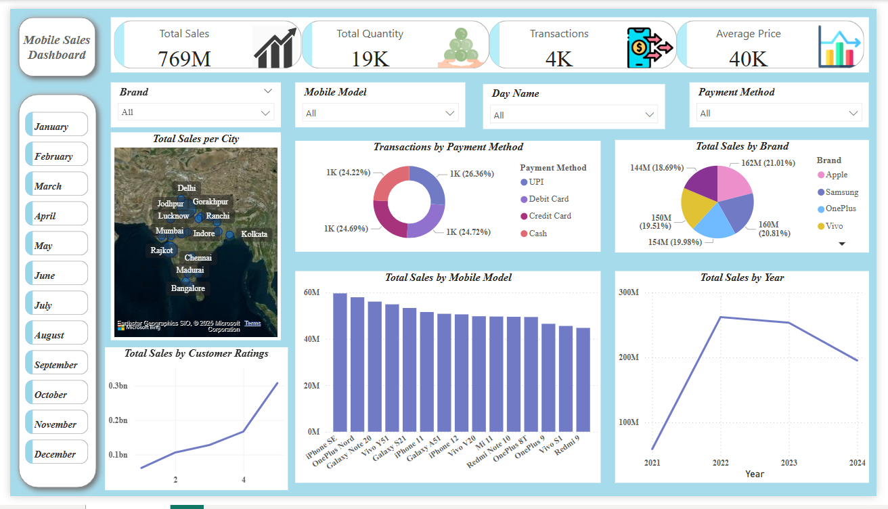

#  Mobile Sales Dashboard - Power BI Project

An interactive Power BI dashboard designed to analyze and visualize mobile phone sales data across various dimensions, helping businesses make data-driven decisions.

##  Features

- Total Sales, Quantity Sold, Total Transactions, Average Price KPIs
- Sales trends over time (Year, Month)
- Sales performance by Brand and Mobile Model
- Geographic sales distribution by City (Map)
- Customer Ratings vs. Sales
- Payment Method preferences
- Dynamic filters and slicers for deeper insights

##  Purpose

To help business users and analysts explore sales performance and customer behavior — supporting decisions on marketing, promotions, and inventory management.

## 📌 How to Use

1. Download the `.pbix` file from this repository
2. Open it in [Power BI Desktop]
3. Explore the dashboard and interact with the filters

